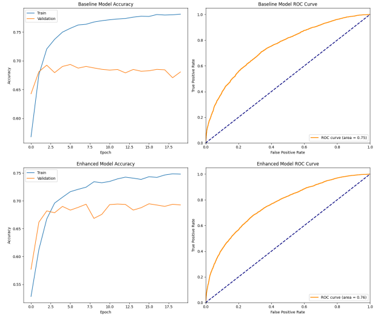
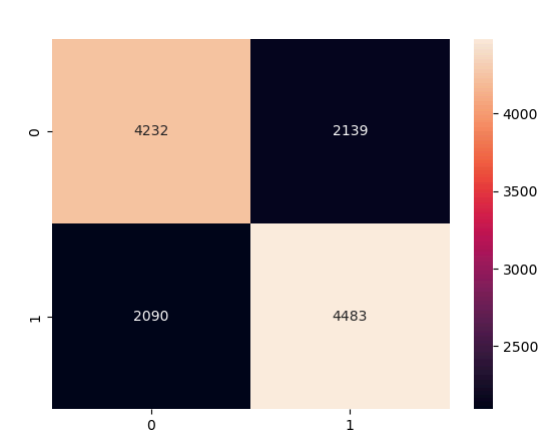

# SentimentSeeker: Movie Review Analyzer

This project is aimed at developing a deep learning model to classify movie reviews as either positive or negative. The project involves data preprocessing, model training using neural network models with embedding layers and dropout regularization, and evaluation using metrics like accuracy, precision, and ROC AUC.

## Overview

Sentiment analysis is a crucial aspect of natural language processing that involves classifying text into sentiments such as positive or negative. In this project, we utilize deep learning techniques to build a robust sentiment analysis model using a dataset of movie reviews.

## Models Used

- **Baseline Model:** A simple neural network with embedding layers and GlobalAveragePooling1D.
- **Enhanced Model:** An improved neural network with additional Dense layers and dropout regularization.

## Data Preprocessing

The preprocessing steps include cleaning the text data, tokenizing, and padding the sequences to ensure they are suitable for input into the neural network models.

## Evaluation Metrics

The models are evaluated using the following metrics:
- Accuracy
- Precision
- Recall
- ROC AUC

## Results

The performance of the models is visualized through various plots.

### Accuracy and ROC Curve

### Correlation Heatmap

## How to Run

1. Clone the repository.
2. Install the necessary libraries.
3. Open the Jupyter notebooks `Updated_Movie_Sentiment.ipynb` and `IMDB_MovieReview_NLP.ipynb`.
4. Run the cells to execute the code and visualize the results.

## Conclusion

The SentimentSeeker project demonstrates the application of deep learning models for sentiment analysis. Through effective preprocessing and model enhancements, the project achieves significant accuracy in classifying movie reviews.

## Repository

[View on GitHub](https://github.com/boss2256/SentimentSeeker-Movie-Review-Analyzer)

